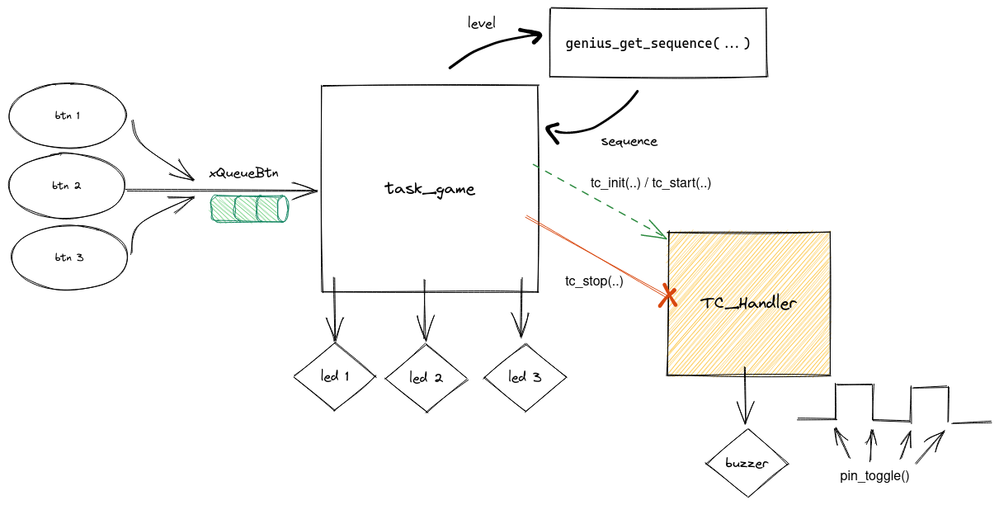

# 22b - AV3 - Genius

Nesta avaliação vocês irão recriar o jogo Genius (Simon).

## Descricão

Periféricos:

- PIO
- TC
- OLED

freeRTOS:

- Task
- Queue

### Genius

O jogo consiste em decorar e reproduzir uma sequência que é apresentada de forma visual e a cada nível a sequência fica maior. Se o jogador continua até o jogador errar a ordem.

### Funcionalidades

Para implementarmos o protótipo do jogo iremos usar a placa OLED (LEDs e botões):

- BTN 1: LED 1
- BTN 2: LED 2
- BTN 3: LED 3

O jogo deve dar fim de Jogo se o jogador:

1. Apertar um botão enquanto a sequência ainda está sendo exibida
1. Errar a ordem
1. Apertar um botão a mais
1. Se o jogador não apertar um botão 500ms deve dar erro

Se o jogador fizer a sequência correta, o jogo deve partir para a próxima fase (incremental).

### Firmware

Vocês devem desenvolver o firmware como indicado a seguir:

- **O código base fornecido é o `RTOS-OLED-Xplained-Pro` já com o RTT e TC adicionado no wizard.**

Onde:

- Botões
  - devem ser configurados para funcionar com `callback`
  - devem enviar o ID `int` para a fila `xQueueBtn` 

- LEDs
  - Exibem a sequência a ser seguida
  
- OLED
  - Exibe o nível **atual** e **FIM DE JOGO** quando acabar

- Buzzer
  - Uma frequência por botão: `[2000 2500 3000]`
  - Vibrar enquanto o LED estiver aceso

- `task_game`
  - Responsável por implementar toda a lógica do jogo
  - Lê os botões do usuário via `xQueueBtn`
  - Aciona os LEDs 
  
- `TC1_Handler`
  - Vibrar buzzer na frequência definida para cada LED 

- `int genius_get_sequence(int level, int *sequence)`
  - **Já foi dada pronta, mas é necessário analisar para entender**
  - Função que deve ser utilizada para definir a sequência dos LEDs de acordo com o nível atingido pelo jogador
  - `return int`: Tamanho da sequência 
  - `int level`: nível de `0` até `512`
  - `int *sequence`: Deve ser um endereço de memória de um vetor, onde a sequência será salva.

### Dicas

1. Crie a `task_game` e usando a função `genius_get_sequence` crie uma sequência e exiba nos LEDs
  - Lembre de configurar os botões (`xQueueBtn`) e LEDs
1. Usando o TC faca o buzzer vibrar na frequência associada ao LED aceso 
  - O buzzer tem que vibrar com no `TC1_Handler`
  - User o `pin_toggle` para isso!
1. Exiba no OLED o nível atual
1. Comece ler a fila `xQueueBtn` e implemente a lógica do jogo
1. Não esqueça do `timeout` do botão
1. Exiba no OLED se o jogar errou ou se vai comecar um nível novo
  - De um pouco de tempo para o jogar pensar entre um nível e outro 

Agora tudo deve estar funcionando, valide todos os requisitos.
